# 09 — Capturas de la aplicación (evidencia visual)

> Capturas reales generadas con **Playwright + Microsoft Edge (headless)** contra la app en
> ejecución local (`http://localhost:5175`) y la base de datos de producción de la tesis.
> Viewports: **móvil 390×844** (fiel al Figma, iPhone 16) y **desktop 1440×900**.
> Datos de demo reales (reportes, publicaciones, notificaciones y colas de moderación).

---

## 9.1 Acceso y registro

| Login (móvil) | Registro (móvil) |
|---|---|
| 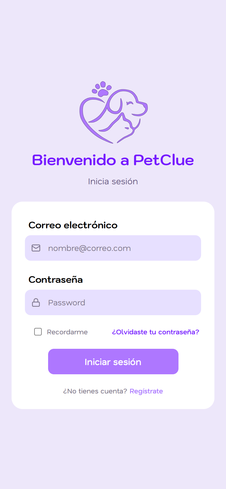 | 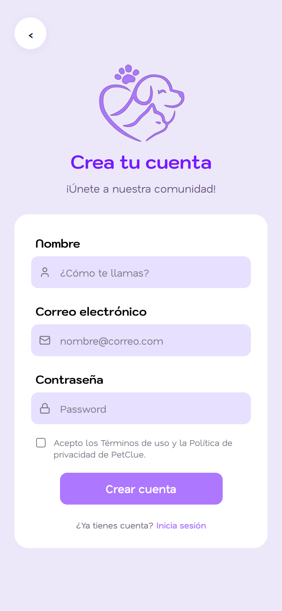 |

- **Login**: logo, "Bienvenido a PetClue", correo/contraseña, recordarme, recuperación.
  Autenticación real contra Supabase Auth.
- **Registro**: nombre/correo/contraseña + aceptación de términos de PetClue; al crear la
  cuenta se muestra el aviso de verificación por correo.

## 9.2 Aplicación móvil (flujo dueño)

| Home | Mapa |
|---|---|
| 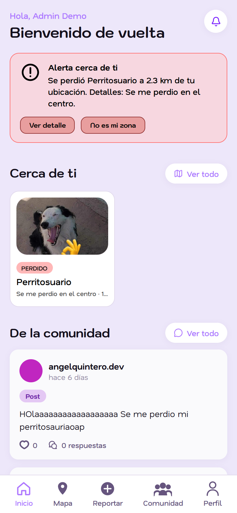 | 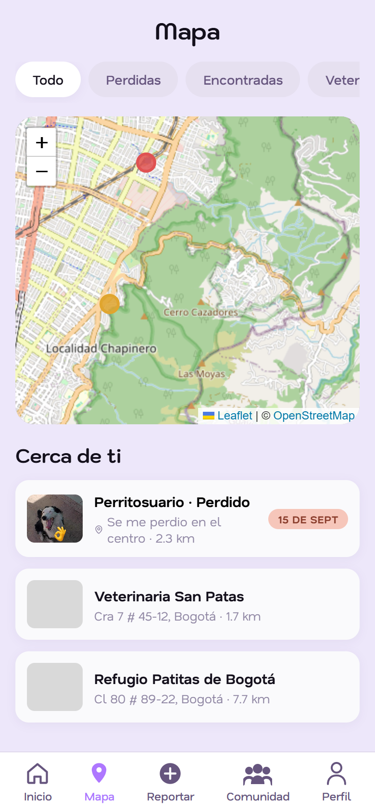 |

- **Home**: saludo personalizado, **alerta geo** ("Se perdió Perritosuario a 2.3 km de tu
  ubicación") con acciones *Ver detalle / No es mi zona*, secciones *Cerca de ti*,
  *De la comunidad*, *En adopción*, *Encontrados* y *Pérdidos*; barra inferior de 5 secciones.
- **Mapa**: filtros *Todo / Perdidas / Encontradas / Veterinarias / Refugios*, marcadores
  Leaflet/OSM y lista "Cerca de ti" con distancia y antigüedad.

| Selector de reporte | Reportar mi mascota | Encontré una mascota |
|---|---|---|
| 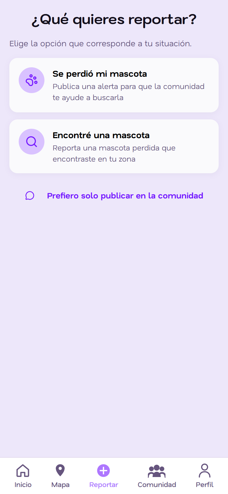 | 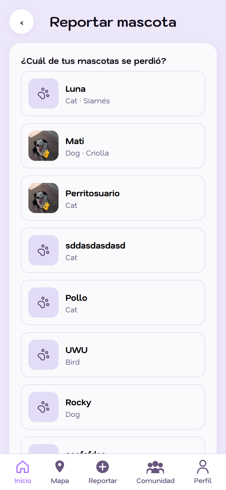 | 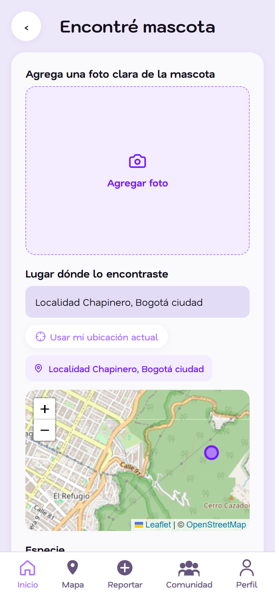 |

- **Selector** (Frame 21): tres caminos — *Se perdió mi mascota*, *Encontré una mascota*,
  *Prefiero solo publicar en la comunidad*.
- **Mi mascota**: selector de mascota registrada (con su foto), lugar (texto + GPS + mapa +
  geocodificación inversa), características, fotos adicionales, fecha y hora aproximada.
- **Encontrada**: formulario del animal callejero (especie/sexo/tamaño/raza/edad/descripción
  + fotos). **Ambos crean reporte + publicación pareada** (alertas interactivas).

| Inscribir mascota | Comunidad | Notificaciones |
|---|---|---|
| 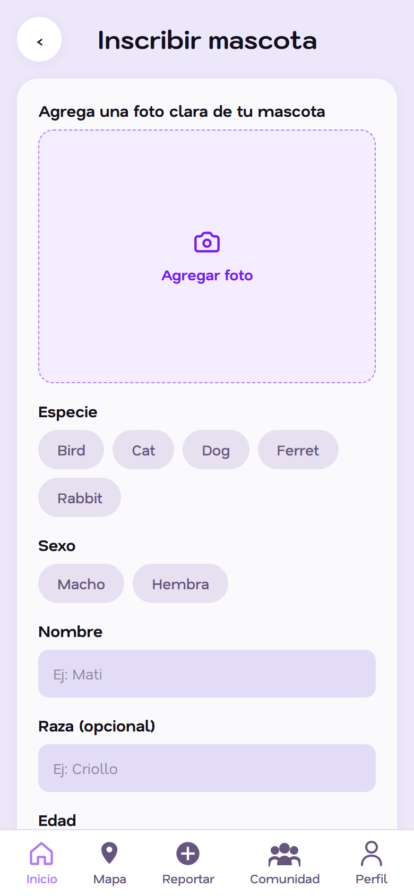 | 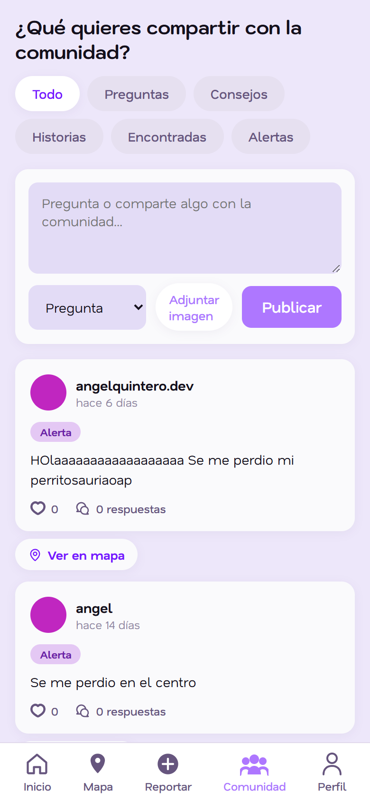 | 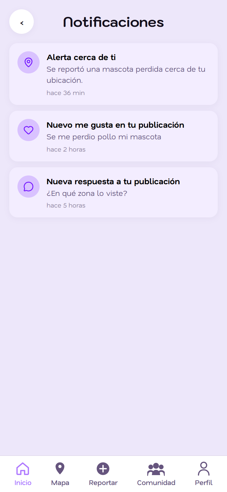 |

- **Inscribir mascota v2**: foto (cámara/galería), especie, sexo, nombre, raza, edad, color,
  tamaño y señas particulares — los datos que alimentan la alerta automática.
- **Comunidad v2**: header "¿Qué quieres compartir…?" + chips
  *Todo/Preguntas/Consejos/Historias/Encontradas/Alertas* y publicaciones con likes/respuestas.
- **Notificaciones**: bandeja con tipos (`geo_alert`, `post_like`, `post_reply`,
  `pet_reminder`) y navegación al tocar (deep links con resaltado).

| Perfil | Cambiar correo | Cambiar contraseña | Ayuda |
|---|---|---|---|
| 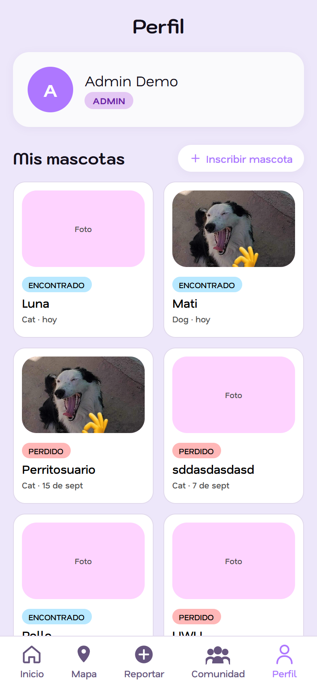 | 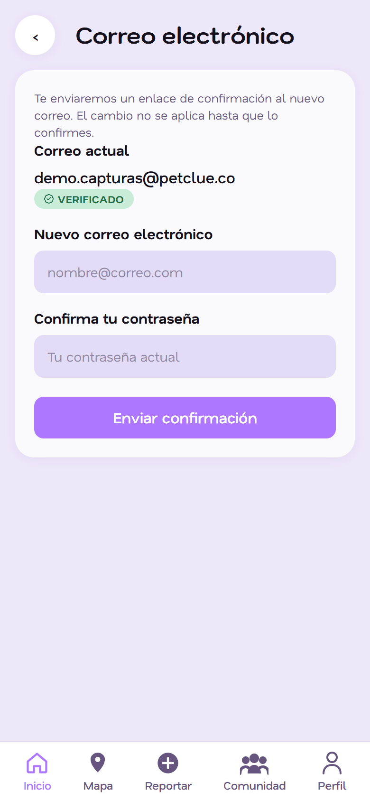 | 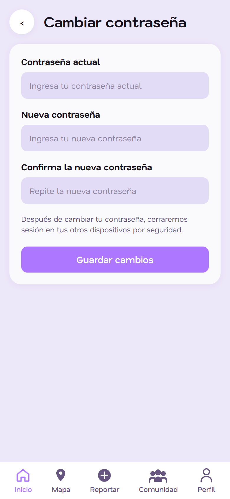 | 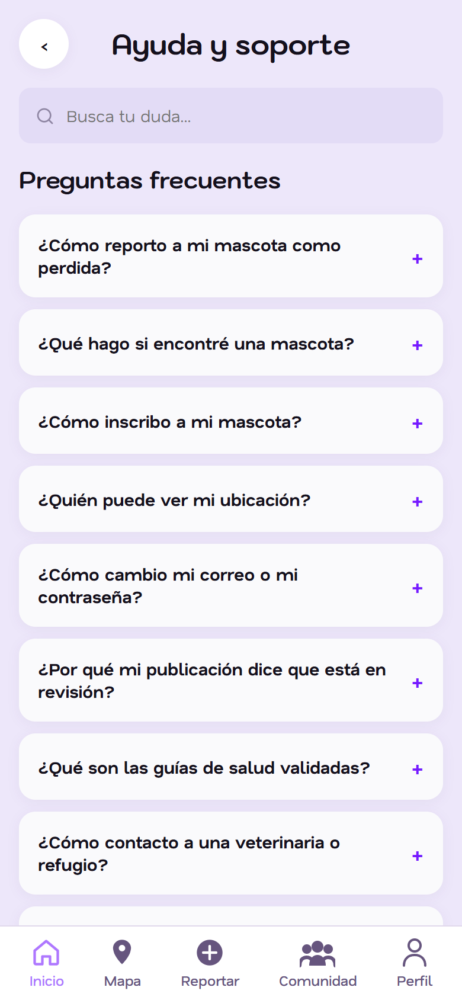 |

- **Perfil**: datos, mascotas, sección *Cuenta* (correo/contraseña/ayuda), preferencias de
  radio de alertas y consentimiento de ubicación.
- **Cuenta**: cambio de correo con confirmación por enlace y cambio de contraseña con cierre
  de sesión en otros dispositivos.
- **Ayuda**: buscador que filtra FAQ + guías de salud validadas por veterinarios.

## 9.3 Vista desktop (responsive)

| Home desktop (sidebar + 4 columnas) | Comunidad desktop (2 columnas) |
|---|---|
| 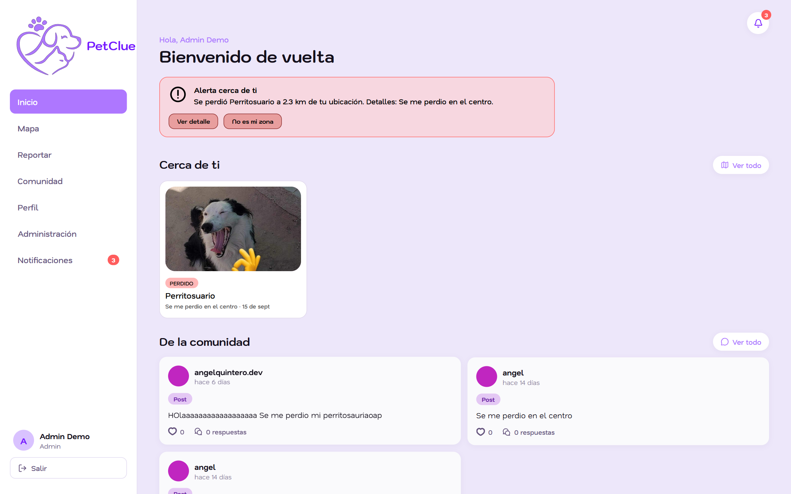 | 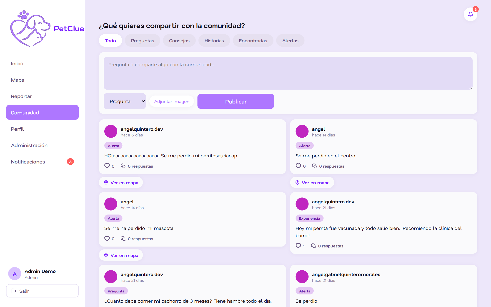 |

El layout cambia de bottom-nav (móvil) a **sidebar con perfil, navegación y campana**
(desktop), manteniendo la identidad visual del Figma.

## 9.4 Panel de administración y moderación

El panel (`/admin`, acceso exclusivo por rol) permite **aprobar o rechazar** el contenido y
las solicitudes de la comunidad:

| Publicaciones por revisar | Solicitudes de veterinarios/fundaciones |
|---|---|
| 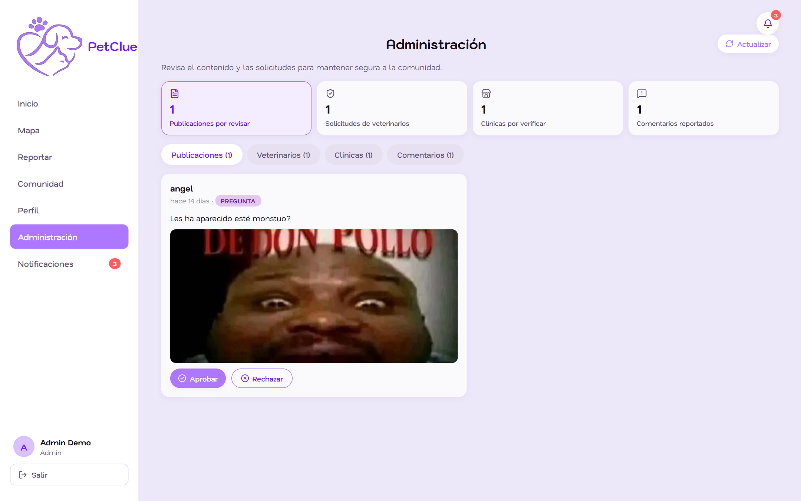 | 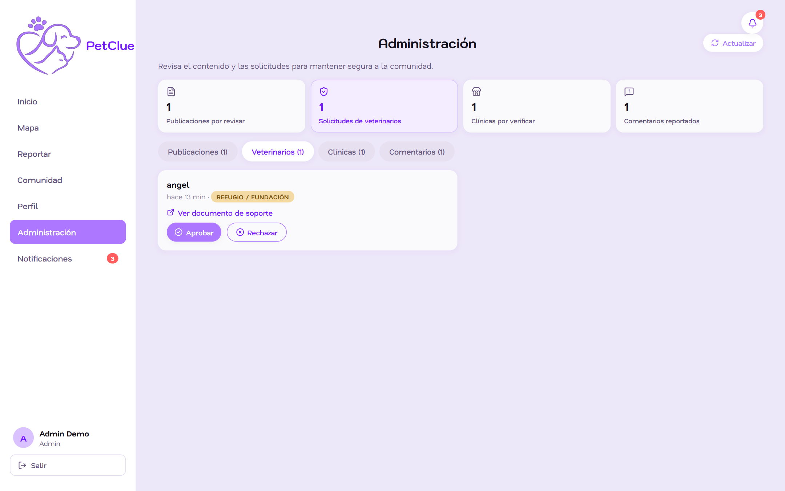 |

- **Publicaciones (1)**: cola de posts en `under_review` con vista previa del contenido y
  botones **Aprobar / Rechazar** (los posts de usuario pasan por moderación; las alertas se
  publican al instante por urgencia).
- **Veterinarios (1)**: solicitudes de verificación (`vet_applications`, rol objetivo
  `vet`/`foundation`) con documento soporte; **Aprobar** habilita al usuario como veterinario
  verificado (puede escribir guías y crear su clínica) y **Rechazar** cierra la solicitud.

| Clínicas por verificar | Comentarios reportados |
|---|---|
| 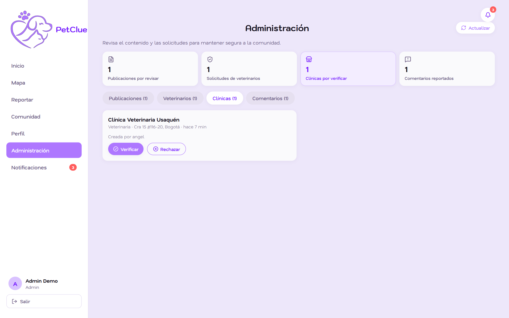 | 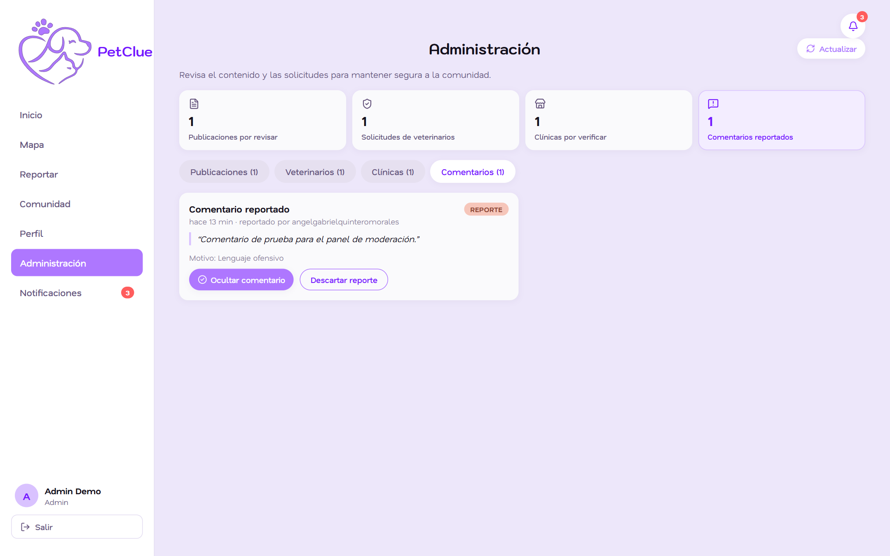 |

- **Clínicas (1)**: clínicas/refugios creados por veterinarios en estado pendiente;
  **Verificar / Rechazar** sella `verified`, `verified_by` y `verified_at` (auditoría).
- **Comentarios (1)**: denuncias de la comunidad (`comment_reports`); se puede **ocultar**
  el comentario (moderación sin borrado) y resolver/dismissar la denuncia.

> **Nota metodológica:** las capturas usan un usuario demo (`demo.capturas@petclue.co`) y
> datos sembrados para la demostración (mascotas, notificaciones, una clínica pendiente).
> Cada acción del panel invoca una RPC que **revalida el rol en el servidor**
> (defensa en profundidad, ver docs 03 y 06 §6.12).
